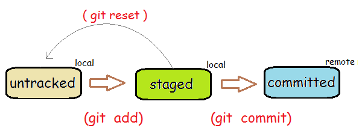

# Git Introduction

Git is a distributed software version control system. It keeps your source code in local and remote repositories and keeps track of all the changes (snapshot) of your software assets include source code, configuration, documents, pictures and etc.

## 1 Basic Concepts

Git keeps a history of your software changes by taking snapshots and store them in a `.git` directory of you project root folder. You use `git init` to create a repository in the current folder.

You decide when to take a snapshot by issuing a `git commit` command.

You can visit any snapshot when you want.

Before committing changes, you can specify which files to be committed using `git add` command to **stage** file changes. The staging area is also called **cache** or **index**.

Create a `.gitignore` file in your project root folder (the folder where `.git` folder sits) to add filenames or filename patterns for files that git should ignore. For node.js application, you don't want to check in installed NPM modules. Add the `node_modules/` to `.gitignore` will work.

You can clone a remote repository to a local repository by `git clone` or add a remote respository by `git remote add` command. Each remote repoistory is identified by its name. The default name for a cloned remote repository is called `origin`. When you add a remote repository, you can give it a name.

Once you add the remote repository, you can **push** changes to the remote repository or **pull** changes made by others from the remote repository.

## 2 Basic Workflow

There are two common scenarios that you work with Github. In the first scenario, you work on an existing project by cloning a remote repository or you first create a new project in Github and then clone the new repository.  The second scenari is that you first create a new local repository and push it to Github later.

### 2.1  Clone a Remote Repository

#### Step 1: Create a Github Repository

If you create a new repository in Github, please select the right project type to add an appripriate `.gitignore` file. Optionally, you can select a license to add a license copyright file.

#### Step 2: Clone the Github Repository

In your Github repoistory page, you can find the url. Use `git clone remote-repository-url` to clone it. The command will create a new folder named after the repository name.

#### Step 3: Work on Local Repository

Then work on this local repostiory. Add new files, change existing files or delete unused files.

#### Step 4: Stage Changes

when you are ready, run `git add .` to stage all changed files.

#### Step 5: Commit Changes

Use `git commit -m "your change message"` to commit changes and create a new snapshot.

Often you want to commit all changes. It is common to combine the staging and committing in one step using command `git commit -a -m "your change message"`.

#### Step 6: Push to Github Repository

Use `git push -u origin master` to push the changes to the remote repository. You may be asked for the username and passord of the remote repository.

Here the `origin` is the original Github respository. The `master` is the master branch of the local repository. As a solo developer, usually you only use one master branch. Optionally you can have mutiple branches for different feature development. But it is another topic.

### 2.2 Create a Local Repository and Push to Github

#### Step 1: Init Local Repository

First initialize a local repository. In your project folder, run `git init`.

#### Step 2: Add `.gitignore` File

For your project type, find a good `.gitignore` template and copy its content to your local `.gitignore` file. This simple [express .gitignore](https://github.com/expressjs/express/blob/master/.gitignore) can be a good start. Add additional files/folders that you want to ignore in this file.

#### Step 3: Work on the Local Repository

Then work on this local repostiory. Add new files, change existing files or delete unused files.

#### Step 4: Stage Changes to Lcoal

when you are ready, run `git add .` to stage all changed files.

#### Step 5: Commit Local Changes

Use `git commit -m "your change message"` to commit changes and create a new snapshot.

Often you want to commit all changes. It is common to combine the staging and committing in one step using command `git commit -a -m "your change message"`.

#### Step 6: Creaet an Empty Github Repository

You need to create a new repository in Github. To avoid errors, do not initialize the new repository with README, license, or gitignore files. You can add these files after your project has been pushed to GitHub. Make a copy of the Github repository url.

#### Step 7: Add Remote Repostiory

Then in your local project root folder, run command `git remote add origin remote-repository-URL` to add the newly created repoistory as `origin`.

To verify the remote repository is ready, run `git remote -v` to check that it is there.

#### Step 8: Push to Remote Repository

Run `git push -u origin master` to push all local committed changes to the remote repository.

## 3 Other Common Tasks

Use `git status` to check current status frequently.

Use `git log` to check the history.

use `git pull` to pull changes from remote repository made by other developers.