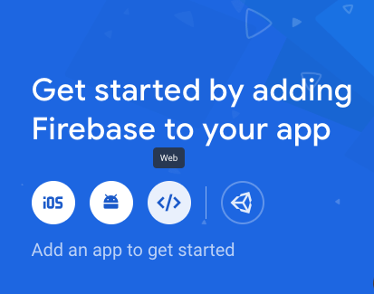

# Firebase

[Firebase](https://firebase.google.com/) is a comprehensive app development platform that include data storage, authentication, analytics, monitoring and many cloud services. In this tutorial you will use the [Cloud Firestore](https://firebase.google.com/products/firestore/) for data storage and access, as well as its hosting service.

This tutorial is based on the [Firebase web Doc](https://firebase.google.com/docs/web/).

## 1. Setup

After signing into Firebase using your Google account, you need to [create a Firebase project](https://firebase.google.com/docs/web/setup).

Step 0, in your web project root folder, create a `public` folder and create an `index.html` in the `public` folder. All web source files(html, css and JavaScript) should be created in this folder.

Step 1, in the [Firebase console](https://console.firebase.google.com/), click **Add Project**, then select or enter a **Project name**, click continmue.

Step 2, Uncheck `Enable Google Analytics for this project` option. Click continue, your project will be create in seconds. Click continue to see the project console.

Step 3, click the web icon **`</>`** to regist your web application. Add a nickname and check the option of **Also setup Firebase Hosting for this app**. Click **Register app** button. Then click **Next**.



Step 4, as instructed, "Copy and paste these scripts into the bottom of your `<body>` tag, but before you use any Firebase services". The sample code is as the foolowing. Click **Next**.

```html
<!-- The core Firebase JS SDK is always required and must be listed first -->
<script src="/__/firebase/7.3.0/firebase-app.js"></script>

<!-- TODO: Add SDKs for Firebase products that you want to use
    https://firebase.google.com/docs/web/setup#available-libraries -->

<!-- Initialize Firebase -->
<script src="/__/firebase/init.js"></script>
```

Step 5, Install Firebase CLI. Run `npm install -g firebase-tools`. You need to install node.js first to use npm. Here is the [node.js download link](https://nodejs.org/en/download/).

Step 6, Deploy to Firebase Hosting. In your local web applicaiton root, run `firebase login` to login first. Sometime you need to run `firebase login --reauth` to refresh login status.

Then run `firebase init` to intialize the setup for local project. The `.firebaserc` file specifies the Firebase project to be used for this application.

Replace the content of `firebase.json` witht the following settings:

```json
{
  "hosting": {
    "public": "public",
    "ignore": ["firebase.json", "**/.*", "**/node_modules/**"]
  }
}
```

Run `firebase serve` to check that your page works correctly. Then run `firebase deploy` to deploy the application. Copy the web URL and check your page is online. You may run `firebase deploy --project project-name` if the firebase doesn't use the right default project.

## 2. User Cloud Firestore

The [Cloud Firestore Document](https://firebase.google.com/docs/firestore) has detail information about Firestore. A quick Firestore introduction is the [official getting started with Firestore](https://youtu.be/2Vf1D-rUMwE).

The first step is to create a Firebase database. For testing puporse, choose `Test mode` and select a local close to the users of your application.

Then create the `public/app.js` file for JavaScript code. Edit the `public/index.html` has the following in its body:

```html
<!-- The core Firebase JS SDK is always required and must be listed first -->
<script src="/__/firebase/7.3.0/firebase-app.js"></script>

<!-- TODO: Add SDKs for Firebase products that you want to use -->
<script src="/__/firebase/7.3.0/firebase-firestore.js"></script>

<!-- Initialize Firebase -->
<script src="/__/firebase/init.js"></script>

<script src="app.js"></script>
```

Write the following content in `public/app.js`:

```js
// get Firestore
const db = firebase.firestore()

// add data
db.collection('users')
  .add({
    first: 'Ada',
    last: 'Lovelace',
    born: 1815,
  })
  .then(function(docRef) {
    console.log('Document written with ID: ', docRef.id)
  })
  .catch(function(error) {
    console.error('Error adding document: ', error)
  })

// read data
db.collection('users')
  .get()
  .then(querySnapshot => {
    querySnapshot.forEach(doc => {
      console.log(`${doc.id} => ${doc.data()}`)
    })
  })
```

Run `firebase serve` to check that your page works correctly. Then run `firebase deploy` to deploy the application. Copy the web URL and check your page is online.

## 3. Firestore Concepts

### Data Model

Firebase is a document-oriented database. Data is stored in documents. Each document contains a set of key-value pairs -- just like a JavaScrit object or a JSON record.

All documents must be stored in collections. A document can contain subcollections and nested documents, ooops, so good! However, a collection cannot contain subcollection or raw data.

The identifiers of documents within a collection are unique. You can provide an identifier or Firestore can create a random name automatically. Simply assign data to a document within a collection. If either the collection or document doesn't exist, Firestore creates it.

To access a doc, there are two ways:

- `db.collection('collection-name').doc('doc-id')`
- `db.doc('collection-name/doc-id')`

### Access Data

There are common ways to add data.

- The `set` method: `db.doc('collection-name/doc-id').set(obj)`.
- The `add` method: `db.collection('collection-name').add(obj)`. Firebase create the doc identifier automatically.

To update data, use `docRef.update(obj)` method.

Use `docRef.delete()` to delete a doc.

Use `docRef.get()` to retrieve a doc. Check `doc.exists` before use the `doc.data`.

To query documents with a condition, use `where()` method, the result is a iterable `querySnapshot`. Without `where()`, all documents are returned. The query supports many composable operations.

To listen for realtime updates, use `docRef.onSnapshot` method. You can listen to all documents, use `db.collection('collection-name').onSnapshot()` method.

The [API doc](https://firebase.google.com/docs/reference/js/firebase.firestore) has detail information.
